# Práctica de Soporte

En este repositorio se encuentran diversos trabajos prácticos, cada trabajo tiene uno o más ejercicios, en cada ejercicio habrá una sección incompleta donde el alumno deberá escribir código. 

Siempre que se introduzca un concepto nuevo, habrá un enlace a la documentación oficial de Python para más información.

La referencia oficial será siempre la [documentación de Python](https://docs.python.org/es/3/), además, se recomienda el curso gratuito en español [Python Para Programadores](https://www.youtube.com/playlist?list=PL6L8P83xTjQ43lioPhb7liCeg5fe6ucaE), que contiene todos los contenidos necesarios para los trabajos prácticos.

# Índice de Trabajo Prácticos

- Práctico 0: Uso de Git y Github
- Práctico 1: Lenguaje Python - Sintaxis y Elementos básicos y avanzados
- Práctico 2: Módulos e Imports
- Práctico 3: Paradigma Orientado a Objetos
- Práctico 4: Bases de Datos 
- Práctico 5: Bases de Datos con ORM (Capa de Datos)
- Práctico 6: Lógica de Negocio (Capa de Negocio)
- Práctico 7: Presentación (Capa de Presentación)
- [Trabajo Práctico Integrador (TPI): Desarrollo de una aplicación completa](TPI/README.md)

# Aclaraciones

Todos los enunciados están dentro de los archivos .py y también se proveen los tests mediante **asserts** para que el alumno pueda verificar si entiende correctamente el enunciado. Cada ejercicio cuenta con tests adicionales que se verificarán automáticamente con cada commit.

La versión de Python a utilizar será Python 3.8.

Se aceptan sugerencias y correcciones mediante PR.

# Como usar esta práctica

Los pasos para usar esta práctica son los siguientes:

## Paso 1: Fork

Hacer un FORK del repositorio, en caso de trabajar en equipos, sólo uno de los integrantes deberá hacer el FORK.

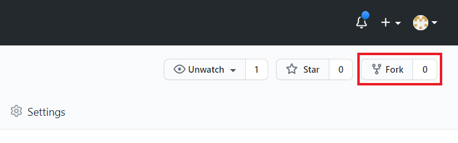

Una vez hecho el FORK debemos cambiar su nombre, el cual debe tener el el siguiente formato: "frro-python-YYYY-NN", donde

- YYYY: año de cursado
- NN: número de grupo

Ejemplo:

    frro-python-2021-03

Para cambiar el nombre de un repositorio iremos a "Settings" y luego "Rename"

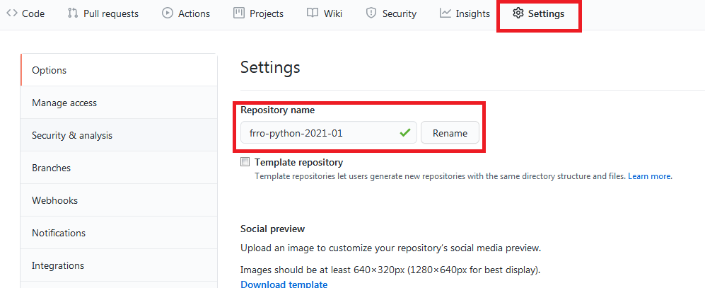

## Paso 2: Añadir Colaboradores

Es necesario añadir a todos los integrantes del grupo y a los profesores como colaboradores del respositorio. 

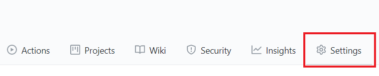

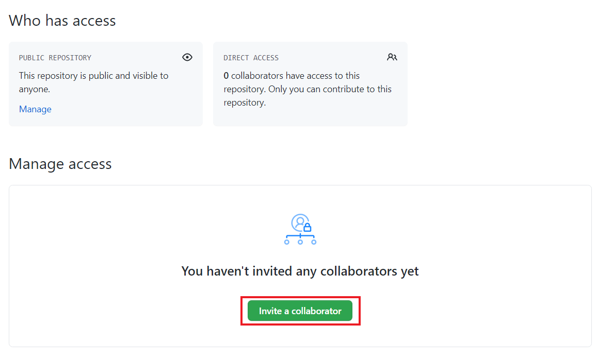

Es posible agregar un colaborador con un email o el nombre de usuario de Github, preguntar en cada caso.

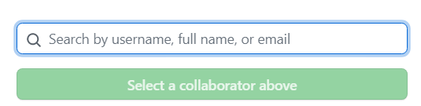

Una vez añadido se enviará una solicitud que deberá ser aceptada, una vez aceptada, el colaborador queda añadido al repositorio.

Se debe agregar a todo el personal de la cátedra y a los integrantes del equipo:

- mac3333 (Mario Castagnino)
- JuanIgnacioTorres (Juan Torres)
- ELC (Ezequiel Castaño)

## Paso 3: Branch

Crear un branch en el nuevo repositorio con el número de trabajo práctico, siguiendo el formato: "practico_XX". El branch debe crearse **desde master**, si se crea desde otro branch, no será válido.

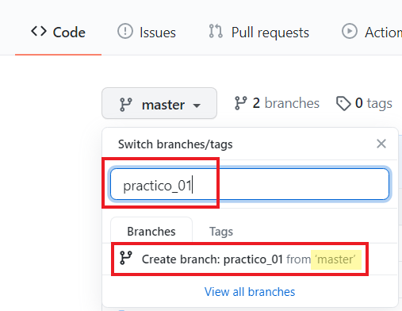

## Paso 4: Commit

Se deberán hacer los commits correspondientes con las soluciones de los ejercicios, el repositorio está configurado para detectar automaticamente los cambios y ejecutar tests para validar la solución. El estado de estos tests puede verse en el estado del repositorio.

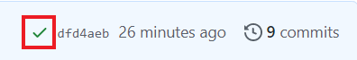

## Paso 5: Evaluación

Existen 4 tipos de tests que se ejecutarán de manera secuencial, uno para verificar la funcionalidad báscia, otro para verificar el estilo, otro para verificar la integridad de la solución y por último uno para los desafios opcionales. Para que una solución se considere válida, los primeros 3 tests tienen que estar aprobados. Al hacer click en el tick verde uno puede ver el detalle de cada evaluación.

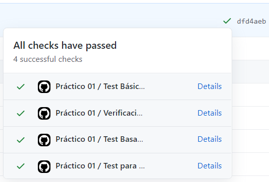

## Paso 6: Corrección

Si alguna de las evaluaciones no fue superada, pueden verse los detalles y hacer las correcciones correspondientes, luego debe hacerse un nuevo commit y las evaluaciones serán ejecutadas nuevamente. Este proceso puede repetirse sin límite.

## Paso 7: Crear Pull Request

Una vez que todas las evaluaciones hayan sido aprobadas, puede hacerse le envio oficial a los profesores mediante un mecanismo llamado Pull Request (PR).

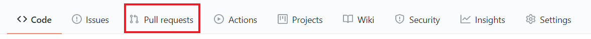

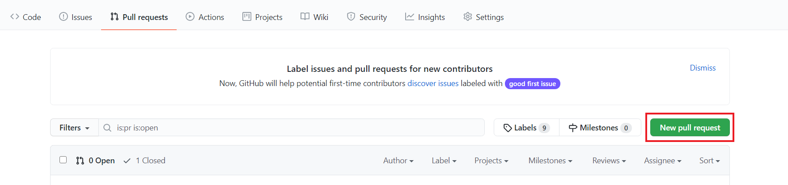

Antes de crear la PR es necesario verificar que le repositorio de destino sea el FORK y no el original. Si en *base* aparece un repositorio que no es el de nuestra cuenta, deberemos elegir el nuestro para mantener los cambios en nuestro repositorio. Si este paso se omite, la PR será rechazada automáticamente

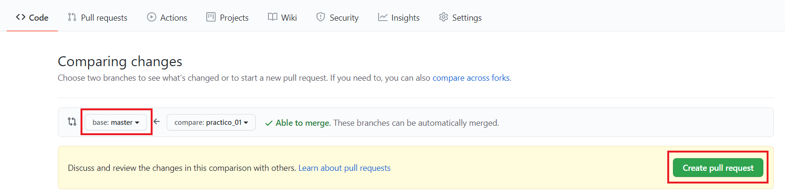

Se debe agregar un título y una descripción a la PR. Con una breve descripción será suficiente.

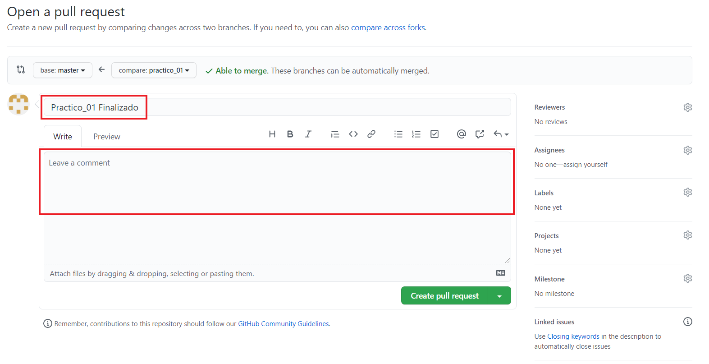

## Paso 8: Agregar Revisores

Para poder corregir la PR es necesario agregar a los profesores como Revisores, esto se hace desde la misma pantalla de la PR. Para poder agregar a los profesores, estos deben ser **colaboradores** del repositorio (Ver Paso 2).

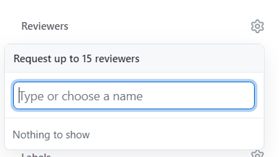

## Paso 9: Enviar PR

Una vez hecha la PR y agregados los profesores como revisores, se debe crear la PR. Los profesores luego verificaran el contenido y haran comentarios pertinentes. Todo el diálogo será mediante la interfaz de Github dentro de la misma PR.

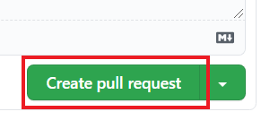

Cuando el trabajo esté aprobado por los profesores, ellos cerrarán la PR.

